# Visiting-Scholar-Research
Forecasting Methane flux (FCH4) measurements in Bog Lake Fen, MN (U.S. Department of Energy site): OLS Regression vs Machine Learning

# Project Summary

I  aim  to  evaluate  and  process  eddy  covariance  and  flux  variance  data  (specifically atmospheric CH4 and CO2) to better understand the ecosystem processes of a peatland site in Marcell  Experimental  Forest,  Bog  Lake  Fen.  Peatlands  serve  an  integral  role  in  the  global biogeochemical cycles – they’re natural sources of two leading greenhouse gases, CO2 and CH4. These sites are susceptible to warming temperatures: peat in this northern region thaws and causes natural vegetation to drown and lakes to brown with solid organic matter that dissolve into the water. This results in vast quantities of CO2 and CH4 emissions being released into aquatic bodies and the atmosphere. The overall objective of this study is to analyze sources and responses within aquatic ecosystems and feedbacks with the atmosphere through CO2 and CH4 flux measurements. 

I created various forecasting models of CH4 flux measurements with simultaneous observations of CO2 flux values, precipitation values, and temperature values (atmospheric and 10CM soil readings). Multiple time series of our data were produced to showcase trends over the years (2009 – 2021) and the influence of seasonality for increasing emissions. Ultimately, we were testing  and  comparing  various  models  (traditional  statistical  methods  like  multiple  linear regression versus machine learning methods like Microsoft Light Gradient Boosting Machine, SARIMAX, Facebook Prophet, and Xgboost) and their accuracy assessments for future flux measurements. Univariate models (just looking at FCH4 or just looking at FCO2) and multivariate models (the incorporation of correlated predictor variables) were compared. We were curious what variables garner the largest influence over CH4 emissions, and if those variables could be integrated into a model that accurately forecasts atmospheric CH4 emissions up to 95% confidence.  

CH4 flux values were assigned the role of our indicator variable. Our predictor variables for the model (in order of influence) were as follows: Soil Temperature, ATM Temperature, CO2 flux values, and Precipitation. We used data captured over the years of 2009 – 2019 as testing values for our model and created different periods for forecasting (one-year into the future, two- year predictions, and so forth). We then compared the accuracy of these forecasts with the actual values of flux measurements. 

## Research Design

Three micrometeorological-towers have been deployed above Bog Lake Fen during the ice-free period, along with several other *in situ* sensors at the lake’s surface (1-2 meters in depth). Thermistor chains extending the surface to the lake’s bottom are regularly deployed throughout the year. If conditions are ideal, a water quality sonde is deployed. Variance fluxes will be estimated across the lake-atmosphere interface using an aerodynamic flux-gradient approach.  

A 3-dimensionsal sonic anemometer-thermometer will be used to obtain the eddy diffusivity. The CH4 vertical concentration gradient above the lake will be measured at intervals of 1.5 meters and 3.5 meters. Atmospheric emissions are recorded using an Ultraportable GHG Analyzer, which quantifies CH4, CO2, and water vapor concentrations near-simultaneously. Air sampling is performed using a custom designed manifold; air will be pulled through this manifold at 406 SLPM using a KNF diaphragm pump. This sampling sequence has two cycles. The first cycle calibration will be set every 6 hours using a zero- air standard measured for 30 seconds and a standard calibration gas measured for 30 seconds. The second cycle will conduct atmospheric sampling through alternating sampled inlets at 15 second intervals. 

The raw mixing ratios will be calibrated using the interpolated calibration data. The final mixing ratios consider flux calculations and will be block-averaged at 30-minute intervals. All sonic anemometer data will be recorded at 10 Hz. AmeriFlux protocols will be followed for routine calculations, corrections, and data quality estimations. 

A buoy system has been implemented to automate in-lake measurements and quantify oscillations in biogeochemical pools, such as carbon and oxygen. Carbon fluxes will be measured through three factors: pH, alkalinity, and dissolved inorganic carbon (DIC). Dissolved oxygen (DO) is a product of photosynthesis and  can  be  used  to  assess  carbon  pools.  A  chlorophyll  sensor  will  be  used  to  analyze  changes  in phytoplankton biomass – and a fluoroprobe will be used to further differentiate algae into varying classes based on pigment signatures. These algal sensors allow for an analysis of phytoplankton’s role on mediating greenhouse gas fluxes. High frequency CO2 sensors will also be used to assess short-term oscillations in the CO2 pool of Bog Lake Fen.

*Study Area: Bog Lake Fen, MN* 

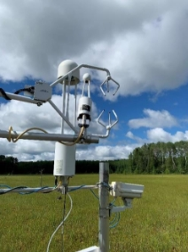

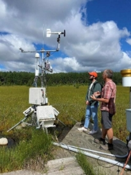

*Eddy Covariance Tower (Research Site)* 

## Project Objectives

- Plot Monthly (2009 – 2021) Variable Averages (Emission Trends & Seasonality) 
- Multiple Linear Regression & Correlation Matrices 
- Forecast Modeling Methane Flux values with Seasonal Variability 
- Time Series Analysis (Univariate & Multivariate)
   
## Results

1. *Monthly Variation Plots (Seasonality Incorporations of Averaged Monthly Emissions)* 

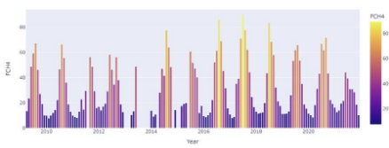

**FCH4** 

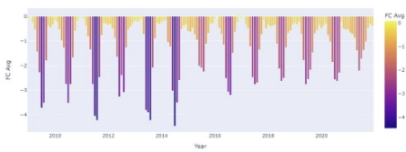

**FCO2** 

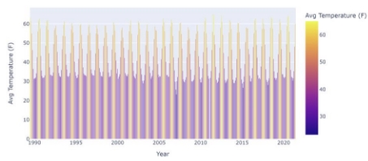

**Atmospheric Temperature (°F)** 

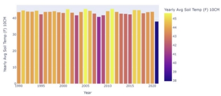

**Soil Temperature (°F)** 

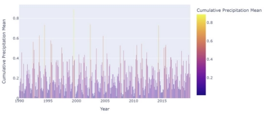

**Cumulative Precipitation Values (mm)** 

2. *Linear Regression Process* 

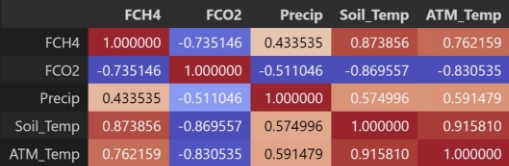

**Correlation Matrix** 

**Outlier Assessment** 

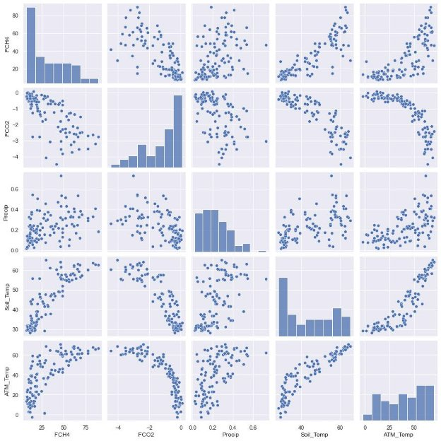

**Scatterplot of all Variables** 

The Correlation Matrix indicates all predictor variables are strongly correlated with our indicator variable  (FCH4).  Soil  Temperature  is  the  highest  correlated  variable  (0.87),  followed  by Atmospheric Temperature (0.76), FCO2 (-0.74), and Precipitation (0.43). Soil Temperature and Atmospheric  Temperature  are  highly  dependent  on  each  other  –  the  Soil  Temperature measurements at the site were captured at 10CM. FCO2 was the only negative association variable in the model, but its influence is significant (Carbon associated with both CH4 & CO2). 

An Outlier Assessment underscores the influence of seasonality with FCH4 measurements; during the  summer  months,  with  augmented  temperatures,  increased  measurements  of  FCH4  were reported. This simple assessment suggests the importance of considering seasonality and capturing trends in environmental data. This is integral for time-series analyses and predictive models. 

The mass scatterplot visualizes the relationships between our variables – another way of expressing the results of our correlation matrix (a visualization to assess linearity, relationships, and the spread of the data). 

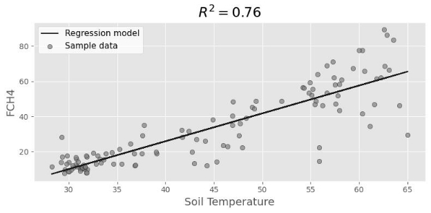

**Simple Linear Regression: FCH4 vs Soil Temperature** 

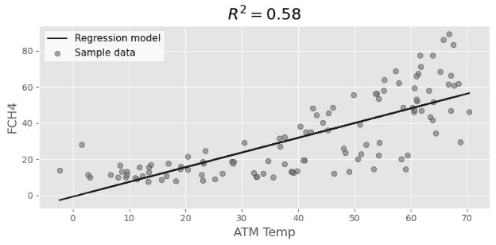

**Simple Linear Regression: FCH4 vs Atmospheric Temperature** 

Building a simple linear regression model is a first-step in assessing the fit of our ML Regression model – I chose to look at Soil Temperature and Atmospheric Temperature, first, because they were the most correlated variables with FCH4. Simply using Soil Temperature returned an R2 value of 0.76 and BIC of 608. 

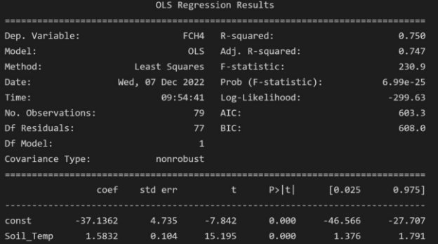

**Simple Linear Regression: OLS Results (FCH4 vs Soil Temperature)** 

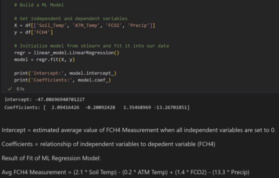

**Fit of ML Regression Model** 

***AVG FCH4 = (2.1 \* Soil Temp) – (0.2 \* ATM Temp) + (1.4 \* FCO2) – (13.3 \* Precip)*** 

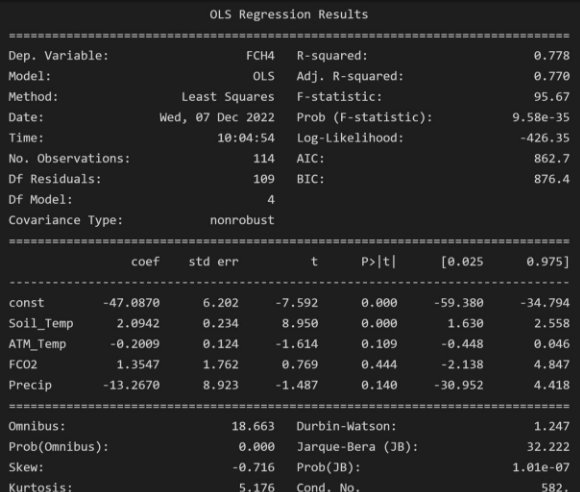

**ML Regression Model (OLS Results)** 

Our Multiple Linear Regression Model (built using all predictor variables – Soil Temperature, Atmospheric Temperature, FCO2 and Precipitation) returned an R2 of 0.78 and BIC of 876.4. The predictive power of this model is marginally higher than our simple linear regression model (just using Soil Temperature as a predictor variable for FCH4), with an increased BIC of 268.4 (our simple linear regression model returned a BIC value of 608, compared to this model’s BIC of 876.4). 

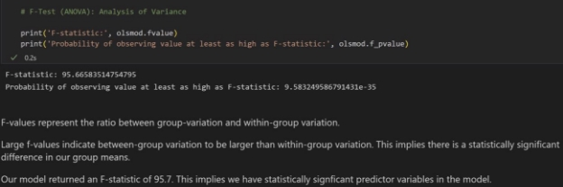

**F-Test (ANOVA)** 

An F-Test (ANOVA) was performed to analyze the variance of our ML Regression Model. Our model returned an F-statistics of 95.7, implying statistical significance of our predictor variables. 

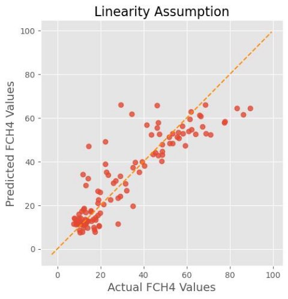

**Linearity Assumption: Actual FCH4 Values vs Predicted FCH4 Values** 

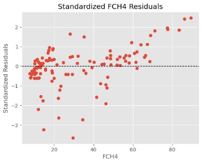

**Standardized Residuals** 

Standardized variables (either the predicted values or the residuals) have a mean of zero and standard deviation of one. If the residuals are normally distributed, 95% of them will fall between -2 and 2. If they fall above or below 2 (in this case, four observations) they are considered unusual. 

Almost all observed residuals of FCH4 measurements fall between -2 and 2 and can therefore be considered normally distributed. 

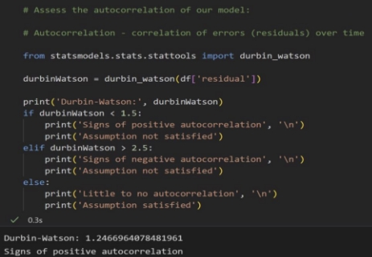

**Autocorrelation Assessment: Durbin-Watson Analysis** 

Our  Durbin-Watson  analysis  showed  signs  of  positive  autocorrelation  -  this  means  that  the increased observed in a time interval will lead to a proportionate increase in the lagged time interval. 

The outcome of a Durbin-Watson test ranges from 0 to 4. An outcome closely around 2 means a very  low  level  of  autocorrelation.  An  outcome  closer  to  0  suggests  a  stronger  positive autocorrelation, and an outcome closer to 4 suggests a stronger negative autocorrelation. 

Our Durbin-Watson result returned a value of 1.2. 

3. *Forecast Modeling – Predictive Estimates of FCH4 Measurements* 

**Supervised Machine Learning (Microsoft Light Gradient Boosting Machine Model)** 

- Variables incorporated were only those indicated to have correlation with FCH4 (ATM temperature, Soil temperature, FCO2, and Precipitation) 
- We used data values from the years 2009 – 2019 to predict 2020 values. 
- We looked for seasonalities and trends by decomposing the time series into 4 states: observed, trend, seasonality, and noise (residuals). 
- We assessed the influence of incorporating lags into our predictive model and created a dataframe with variables ranked in importance on our model. We trained a model without lags, and we trained a model with lags. 
- Our first attempt at forecasting FCH4 emissions was set to one week, meaning we plotted the real values versus predicted values for the last week of the dataset. This was a test to see if the SML model worked. 
- We then created a 1-year lag variable by shifting the target value (FCH4) back a year 

**Decomposed Time-Series: Observed, Trend, Seasonality, and Noise (Residuals)** 

**Real vs Predicted (Mean Average Error of 4.23) SARIMAX: Univariate (FCH4) Predictive Modeling** 

- Seasonal Auto-Regressive Integrated Moving Average w/ eXogenous factors (SARIMAX) 
- Includes seasonal effects & eXogenous factors w/ the autoregressive and moving average computed in the model 
- Only looking at FCH4 data for the years 2009 – 2019 to predict 2020 emissions. 
- Decompose dataframe by an ‘additive’ model to isolate 4 factors: observed, trend, seasonality, and residuals. 
- Compute parameter combinations for Seasonal Arima through iterative process. Use these parameters to incorporate seasonality. 
- Plot the predictive model for FCH4 – observed vs predicted – based on a 1-year forecast. 

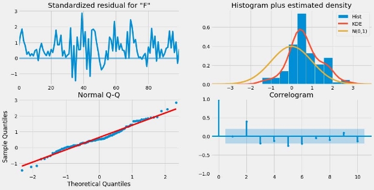

**Four-Series Assessment: Residuals, Q-Q Plotting, Histogram, Correlogram** 

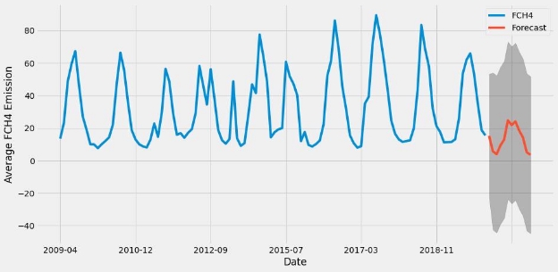

**SARIMAX Predictive Modeling for 2020 FCH4 Emissions Facebook Prophet: Univariate (FCH4) Two-Year Forecasting (2022 Emissions)** 

- Forecasting time series data based on an additive model where non-linear trends are fit with yearly, weekly, and daily seasonality, plus holiday effects. It works best with time series that have strong seasonal effects and several seasons of historical data. Prophet is robust to missing data and shifts in the trend, and typically handles outliers well. 
- Univariate analysis (FCH4) from 2009 – 2019 emissions to predict 2022 emissions. 
- Visualize monthly average of FCH4 emissions (y) 
- Set the uncertainty interval to 95% 
- Assess overall trend in FCH4 emissions (completely linear) and monthly level. Yearly seasonality shows FCH4 is highest in Summer (July) and tapers off in January. 
- Automatically isolate largest quantity of change points where the rate has highest amount of change. 

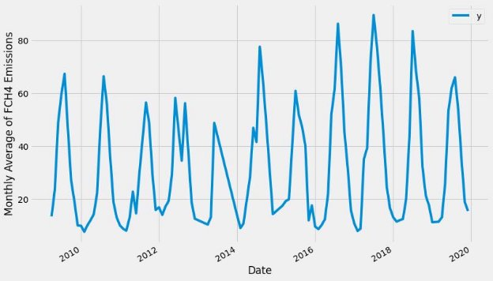

**Visualizing Monthly Averages of FCH4 (y)** 

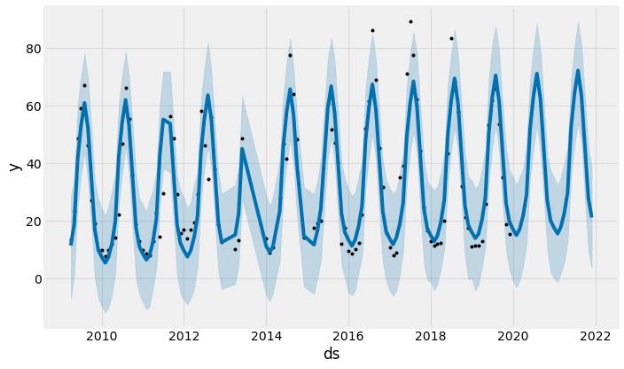

**Forecasting Model (2022 Predictions Based on 95% C.I. and Outlier Detection)** 

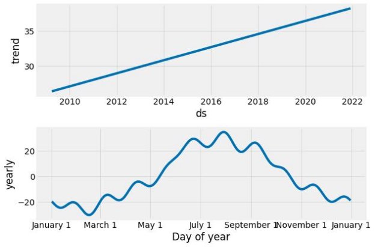

**Trend: Linear Increase of FCH4 Estimates (with Monthly Peaks and Tapers)** 

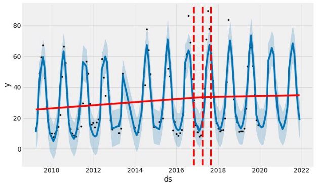

**Facebook Prophet Predictive Model: Trends and Year of Highest Variability (2017)** 

**Facebook Prophet: Multivariate Time-Series Analysis** 

- Set start date for model (1990-01) and end date for model (2022-01). Choose a date for splitting, training, and testing dataset (2017-01). 
- Variables incorporated into model: Soil Temperature, ATM Temperature, Precipitation, and FCH4. 
- Trained the model with all values <= the training end date (2017-01). Tested the model with all values > the training end date (2017-01). Basically, our training dataset captured all values from 1990-01-01 through 2017-01-01. Our testing dataset captured all values from 2019-02-01 through 2021-12-01. Based on the threshold data set, there are 325 data points in the training dataset and 59 data points in the testing dataset. 
- We then created a univariate baseline model using the default Prophet hyperparameters – and then fit the model using the training dataset. Prophet automatically fits daily, weekly, and yearly seasonalities. 
- To make a forecast, we need to first create a time range for future predictions (periods). Black dots are the actual values. Blue line is the prediction. Blue shades are the uncertainty interval (80% is FB Prophet default). The uncertainty interval is calculated based on the assumption that the average frequency and magnitude of trend changes in the future will be the same as the historical data. The historical data trend changes are projected forward to get the uncertainty intervals. 
- Next step is to assess the model’s performance. The forecast dataframe doesn’t include the actual values, so we need to merge the forecast dataframe with the test dataframe to compare the actual values with the predicted values. 
- The mean absolute percent error (MAPE) for the baseline model was 5.5%, meaning that on average the forecast is off by 5.5 of the FCH4 emission value. 
- We then tuned the model to make better estimations by forcing the model to consider yearly seasonality. 
- We created a multivariate model that considered seasonality and added our predictor variables as regressors. 

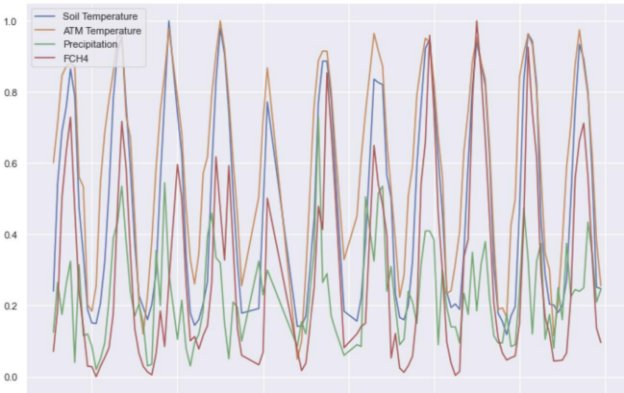

**Standardized Averages of All Variables (For a ‘Same-Scale’ Analysis)** 

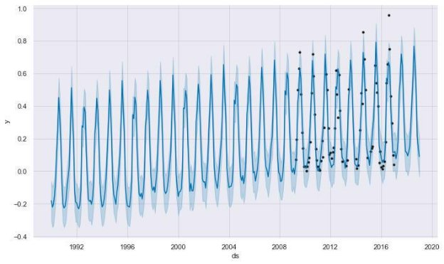

**Facebook Prophet Multivariate Predictive Model (2020 Emission Estimates)** 

**The Final Dive: Comparing Machine Learning Models for FCH4 & FCO2 Estimates** 

- Forecast 52 weeks into future (2022). 
- Plot the monthly flux measurements. 
- Examine the correlation between the series (FCH4 and FCO2). Correlation = -74.90%. 
- Assess autocorrelation for FCH4 and FCO2. 
- Check stationarity for FCH4 and FCO2 using Augmented Dicky-Fuller method 
- Tune forecast for 52-week prediction and create baseline model that doesn’t account for seasonality (no lags). 
- Optimize model to incorporate seasonality (lags) and use a weighted average to determine best model by isolating lowest test level MAPE. 
- Plot updated forecast for FCH4 and FCO2 emissions and compare the MAPE results for each machine learning method. 
- Create a Layer Stacking for the 3 best methods (the top 3 with lowest MAPE results) for FCH4 and FCO2. 
- Update forecast by comparing MAPE results for layer stacked results. 
- Create a single forecast using the best machine learning method for FCH4 and FCO2 (XGBOOST) 

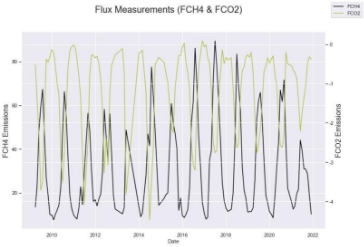

**FCH4 & FCO2 Measurements (Time-Series) into 2022** 

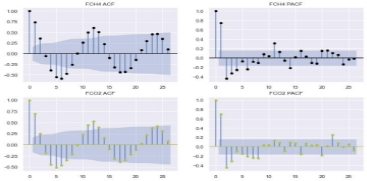

**Autocorrelation Assessment** 

**Dickey-Fuller Analysis (Stationarity in FCO2… but not FCH4)** 

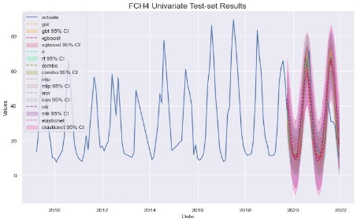

**FCH4 Forecasting (Comparing Deep Learning Models)** 

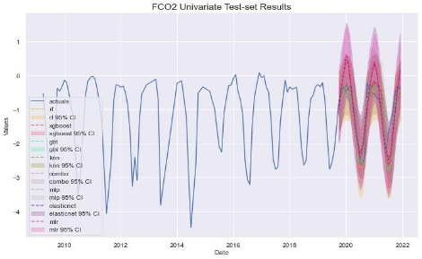

**FCO2 Forecasting (Comparing Deep Learning Models)** 

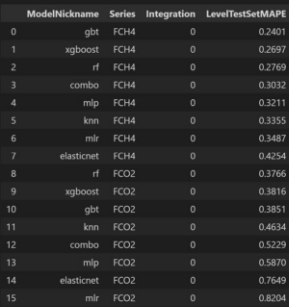

**Comparison of Deep Learning Models (Choose Models with Lowest MAPE)** 

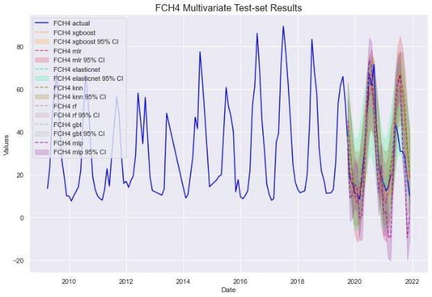

**FCH4 Multi-Variate Forecasting (Comparing Deep Learning Models)** 

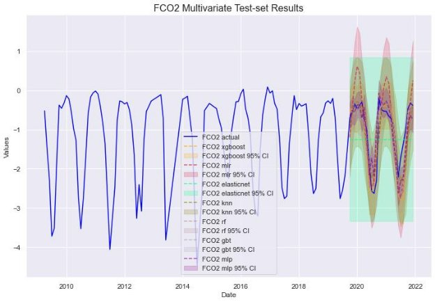

**FCO2 Multi-Variate Forecasting (Comparing Deep Learning Models)** 

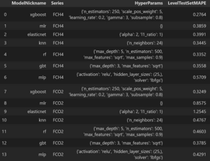

**Model Results: Improvements & MAPE Scores** 

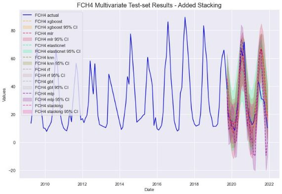

**FCH4 Multi-Variate (Layer Stacking)** 

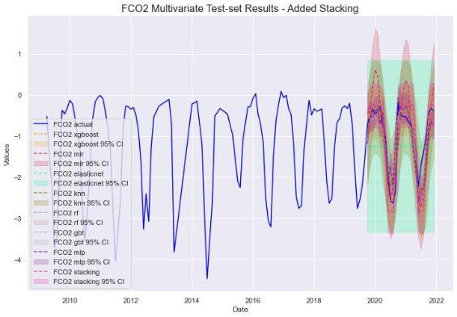

**FCO2 Multi-Variate (Layer Stacking)** 

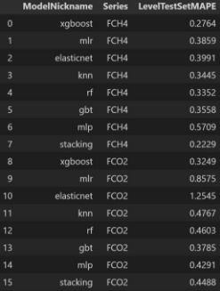

**Model Cross-Comparison (MAPE Scores vs R2 Results) for Multi-Variate Models** 

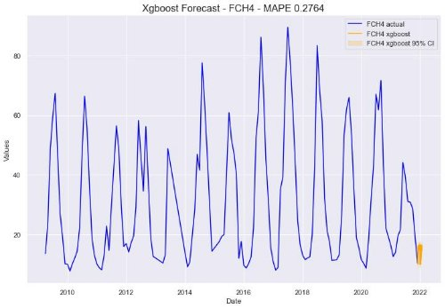

**XGBOOST: Best Deep Learning Model for Forecasting FCH4 (Based on ↓ MAPE)** 

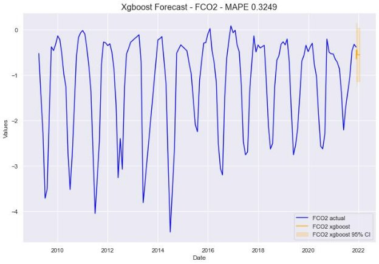

**XGBOOST: Best Deep Learning Model for Forecasting FCO2 (Based on ↓ MAPE)** 
